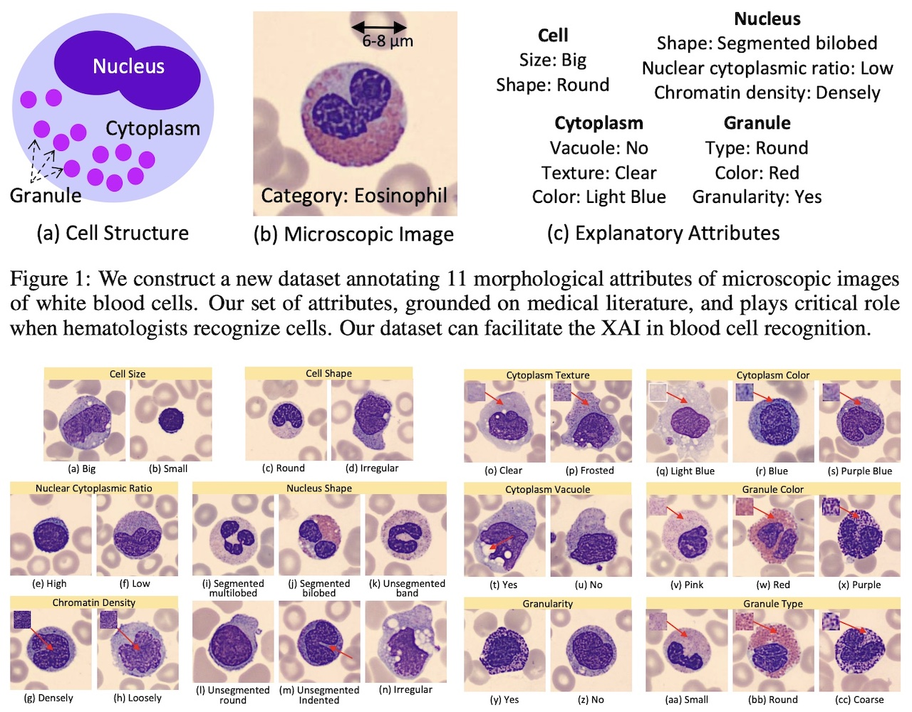

# WBCAtt: A White Blood Cell Dataset Annotated with Detailed Morphological Attributes
  

This is the official repository for the WBCAtt dataset.
- Dataset and code is [here](./submission/). 
-  Satoshi Tsutsui, Winnie Pang, and Bihan Wen. WBCAtt: A White Blood Cell Dataset Annotated with Detailed Morphological Attributes.  Advances in Neural Information Processing Systems (NeurIPS) 2023.
- We've annotated 113k labels (11 attributes x 10.3k images) on white blood cell images, detailing the fine-grained concepts pathologists recognize. Annotating at this level of detail and scale is unprecedented, offering unique value to AI in pathology. Please refere to the paper below for more details. 

## Reference
- *Arxiv*: [https://arxiv.org/abs/2306.13531](https://arxiv.org/abs/2306.13531)
- *Abstract*: The examination of blood samples at a microscopic level plays a fundamental role in clinical diagnostics, influencing a wide range of medical conditions. For instance, an in-depth study of White Blood Cells (WBCs), a crucial component of our blood, is essential for diagnosing blood-related diseases such as leukemia and anemia. While multiple datasets containing WBC images have been proposed, they mostly focus on cell categorization, often lacking the necessary morphological details to explain such categorizations, despite the importance of explainable artificial intelligence (XAI) in medical domains. This paper seeks to address this limitation by introducing comprehensive annotations for WBC images. Through collaboration with pathologists, a thorough literature review, and manual inspection of microscopic images, we have identified 11 morphological attributes associated with the cell and its components (nucleus, cytoplasm, and granules). We then annotated ten thousand WBC images with these attributes. Moreover, we conduct experiments to predict these attributes from images, providing insights beyond basic WBC classification. As the first public dataset to offer such extensive annotations, we also illustrate specific applications that can benefit from our attribute annotations. Overall, our dataset paves the way for interpreting WBC recognition models, further advancing XAI in the fields of pathology and hematology.
```
@inproceedings{tsutsui2023wbcatt,
  title={WBCAtt: A White Blood Cell Dataset Annotated with Detailed Morphological Attributes},
  author={Tsutsui, Satoshi and Pang, Winnie and Wen, Bihan},
  booktitle={Advances in Neural Information Processing Systems (NeurIPS).},
  year={2023}
}
```
